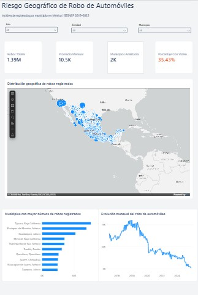

# Automobile Theft Risk Analysis in Mexico

\### Municipal crime incidence analysis using SQL Server, Python and Power BI | SESNSP 2015–2025

This project analyzes official municipal crime data published by the \*\*Secretariado Ejecutivo del Sistema Nacional de Seguridad Pública (SESNSP)\*\* to study the geographic concentration, temporal evolution, and violence modality of automobile theft in Mexico.

The analysis focuses specifically on \*\*four-wheel automobile theft\*\*, distinguishing between incidents registered \*\*with violence\*\* and \*\*without violence\*\*.

The project was developed as an end-to-end data analytics workflow using:

\- \*\*SQL Server\*\* for data storage, transformation, and analytical queries.

\- \*\*Python / Pandas\*\* for data exploration, validation, and dataset preparation.

\- \*\*Power BI\*\* for data modeling, DAX measures, and interactive visualization.

\---

\## Business Objective

For organizations related to the automotive and insurance industries, geographic location and the evolution of vehicle theft are relevant variables for understanding territorial exposure to crime.

The objective of this project is to develop a reproducible analysis that identifies:

\- Geographic concentration of registered automobile theft.

\- Temporal trends between 2015 and 2025.

\- Municipalities with the largest year-over-year changes.

\- The proportion of thefts involving violence.

\- Differences between violent and non-violent theft across municipalities and time periods.

---

\## Power BI Dashboard

The Power BI dashboard was designed to explore automobile theft from three analytical perspectives:

1. **Geographic Risk** — identifies municipalities with the highest registered volume of automobile theft.
2. **Risk Trends** — analyzes historical evolution and year-over-year changes.
3. **Violence Modality** — compares violent and non-violent automobile theft.

### Geographic Risk

