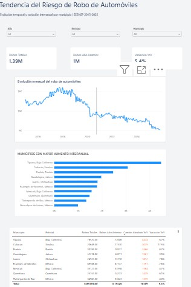
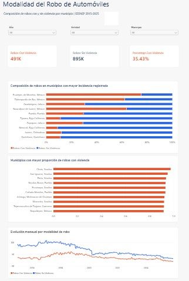

# Automobile Theft Risk Analysis in Mexico


### Municipal crime incidence analysis using SQL Server, Python and Power BI | SESNSP 2015–2025

This project analyzes official municipal crime data published by the **Secretariado Ejecutivo del Sistema Nacional de Seguridad Pública (SESNSP)** to study the geographic concentration, temporal evolution, and violence modality of automobile theft in Mexico.

The analysis focuses specifically on **four-wheel automobile theft**, distinguishing between incidents registered **with violence** and **without violence**.

The project was developed as an end-to-end data analytics workflow using:

- **SQL Server** for data storage, transformation, and analytical queries.
- **Python / Pandas** for data exploration, validation, and dataset preparation.
- **Power BI** for data modeling, DAX measures, and interactive visualization.

---

## Business Objective


For organizations related to the automotive and insurance industries, geographic location and the evolution of vehicle theft are relevant variables for understanding territorial exposure to crime.


The objective of this project is to develop a reproducible analysis that identifies:


\- Geographic concentration of registered automobile theft.

\- Temporal trends between 2015 and 2025.

\- Municipalities with the largest year-over-year changes.

\- The proportion of thefts involving violence.

\- Differences between violent and non-violent theft across municipalities and time periods.

---


\## Power BI Dashboard


The Power BI dashboard was designed to explore automobile theft from three analytical perspectives:

1. **Geographic Risk** — identifies municipalities with the highest registered volume of automobile theft.
2. **Risk Trends** — analyzes historical evolution and year-over-year changes.
3. **Violence Modality** — compares violent and non-violent automobile theft.

### Geographic Risk


### Risk Trends

This page analyzes the temporal evolution of automobile theft and year-over-year changes, helping identify municipalities where registered theft has increased or decreased.



### Violence Modality

This page compares automobile theft registered with and without violence and identifies municipalities with the highest proportion of violent theft.



---

## Data Workflow

The project follows an end-to-end data analytics workflow:

**SESNSP Open Data → SQL Server → Python / Pandas → Power BI**

### 1. Data Source
Official municipal crime incidence data from the **SESNSP**, covering the period from **2015 to 2025**.

The original dataset contains more than **2.5 million records** and includes information by state, municipality, crime type, modality, and month.

### 2. SQL Server
SQL Server was used to:

- Store the original municipal crime dataset.
- Transform monthly columns into an analytical monthly structure.
- Preserve the original raw data while handling invalid negative values in analytical views.
- Filter automobile theft specifically to four-wheel vehicles.
- Separate thefts into **with violence** and **without violence**.
- Perform exploratory and year-over-year analyses.

### 3. Python / Pandas
Python was used to:

- Explore and validate the original dataset.
- Verify missing values, duplicates, negative values, and geographic coverage.
- Validate the transformed SQL dataset.
- Create a standardized municipality identifier.
- Export the processed dataset used as a reproducible analytical output.

### 4. Power BI
Power BI was used to:

- Build the analytical data model.
- Create a calendar and municipality dimension.
- Develop DAX measures and year-over-year comparisons.
- Analyze geographic concentration and temporal trends.
- Compare violent and non-violent automobile theft.
- Build the final interactive dashboard.

---

## Data Cleaning & Transformation

The original SESNSP municipal dataset required several validation and transformation steps before it could be used for analysis.

### Raw Data Validation

The original dataset contains:

- **2,562,994 rows**
- **21 columns**
- Data from **2015 to 2025**
- **32 Mexican states**
- Monthly crime counts stored across twelve separate columns
- Geographic, crime classification, subtype, and modality information

Initial exploration with Python confirmed that the dataset contained no missing values or duplicated rows.

Two negative monthly crime values were identified. Because the official documentation did not provide a clear interpretation for these values, the raw records were preserved and the negative values were treated as `NULL` in the analytical SQL view rather than being replaced with zero.

### CSV Import

The original CSV contains quoted text fields that may include commas. A standard delimiter-based import initially caused parsing issues.

The SQL Server import was therefore configured using CSV-aware parsing and quoted-field handling:

```sql
FORMAT = 'CSV',
FIELDQUOTE = '"'
```

---

## Project Structure

```text
crime-risk-analysis-mexico/
│
├── dashboard/
│   ├── CrimeRiskAnalysis.pbix
│   ├── screenshots/
│   │   ├── 01_riesgo_geografico.jpg
│   │   ├── 02_tendencia_riesgo.jpg
│   │   └── 03_modalidad_violencia.jpg
│   └── wireframes/
│       ├── CrimeRiskAnalysis.jpg
│       ├── CrimeRiskAnalysis2.jpg
│       ├── CrimeRiskAnalysis3.jpg
│       └── dashboard_wireframes.drawio
│
├── data/
│   ├── raw/
│   │   └── .gitkeep
│   └── processed/
│       └── riesgo_automotriz_municipal.csv
│
├── notebooks/
│   ├── 01_data_exploration.ipynb
│   └── 02_dashboard_dataset.ipynb
│
├── sql/
│   ├── 01_create_database.sql
│   ├── 02_create_raw_table.sql
│   ├── 03_create_monthly_view.sql
│   ├── 04_create_automotive_risk_view.sql
│   └── 05_analysis_queries.sql
│
├── .gitignore
└── README.md

---

## Key Findings

- Approximately **1.39 million four-wheel automobile thefts** were registered in the analyzed data between 2015 and 2025.

- Automobile theft shows a clear geographic concentration. Municipalities such as **Tijuana, Ecatepec de Morelos, Guadalajara, Puebla, and Toluca** appear among the locations with the highest registered theft volumes over the analyzed period.

- The historical trend increased during the first years of the analysis and reached its highest levels around **2018–2019**, followed by a sustained decline in registered automobile theft through 2025.

- Approximately **35.4% of registered automobile thefts involved violence**, representing about **491 thousand incidents**, compared with approximately **895 thousand thefts without violence**.

- The proportion of violent theft varies substantially between municipalities. Therefore, total theft volume and violence composition provide different perspectives when evaluating territorial crime patterns.

- Year-over-year analysis shows that municipal trends do not move uniformly: while the national historical series has declined from its previous peak, some municipalities still show increases when compared with the previous year.

---

## Limitations & Data Considerations

The results of this project should be interpreted considering the following limitations:

- **Registered crime incidence:** The dataset represents crimes registered by Mexican authorities. It should not be interpreted as a complete measurement of all automobile theft events that may have occurred.

- **Territorial risk vs. individual probability:** The analysis measures geographic concentration and historical incidence of automobile theft. It does **not** calculate the probability that an individual vehicle will be stolen.

- **Vehicle exposure:** Variables such as the number of registered vehicles, insured vehicles, vehicle models, vehicle values, policy exposure, and population were not incorporated. Therefore, the results should not be interpreted as actuarial claim frequencies or insurance pricing indicators.

- **Municipal coverage:** The number of municipalities represented in the source data changes over time. Coverage increases notably between 2016 and 2017, meaning that part of the variation between years may be influenced by changes in geographic coverage.

- **Negative source values:** Two negative monthly values were identified in the original dataset. Since their meaning could not be established from the available documentation, the original records were preserved and these values were treated as missing (`NULL`) in the analytical SQL layer.

- **Violence ranking threshold:** The ranking of municipalities by percentage of violent automobile theft only includes municipalities with at least **100 registered thefts** in the selected context. This is an analytical threshold designed to reduce distortions caused by very small denominators and is not an official or actuarial threshold.

- **Geographic visualization:** Map locations are based on municipality and state names interpreted by the geographic visualization service. Geographic points should therefore be understood as visualization references rather than precise crime coordinates.

---

## Data Source

The analysis uses official open crime data published by the **Secretariado Ejecutivo del Sistema Nacional de Seguridad Pública (SESNSP)**.

The source dataset contains municipal crime incidence records classified by year, state, municipality, crime category, subtype, modality, and month.

**Source:**  
https://www.gob.mx/sesnsp/acciones-y-programas/datos-abiertos-de-incidencia-delictiva

The original raw dataset is not included in this repository due to its file size. It can be downloaded directly from the official SESNSP open-data portal.

A processed analytical dataset is available in:

`data/processed/riesgo_automotriz_municipal.csv`

---

## Technologies Used

- **SQL Server** — data storage, transformation, analytical views, window functions, aggregations, and year-over-year analysis.
- **Python** — data exploration and validation.
- **Pandas** — data manipulation, quality checks, and analytical dataset preparation.
- **SQLAlchemy / PyODBC** — connection between Python and SQL Server.
- **Power BI** — data modeling, DAX measures, interactive analysis, and dashboard development.
- **Power Query** — data loading and type validation.
- **Git & GitHub** — version control and project documentation.
- **Jupyter Notebook** — reproducible Python analysis.
- **diagrams.net** — dashboard wireframing and layout planning.

---

## Reproducing the Project

The repository is organized so that the main analytical workflow can be reviewed and reproduced.

1. Download the original municipal crime dataset from the official SESNSP open-data portal.
2. Place the source files inside `data/raw/`.
3. Execute the SQL scripts in numerical order from the `sql/` directory.
4. Run `notebooks/01_data_exploration.ipynb` to inspect and validate the raw dataset.
5. Run `notebooks/02_dashboard_dataset.ipynb` to validate the SQL analytical view and generate the processed dataset.
6. Open `dashboard/CrimeRiskAnalysis.pbix` in Power BI Desktop to explore the final dashboard.

> Connection strings and local file paths may need to be adjusted depending on the user's SQL Server and local environment.

---

## Conclusion

This project demonstrates an end-to-end data analytics workflow applied to a large official public dataset, from raw data ingestion and validation to SQL transformation, Python analysis, data modeling, and interactive visualization in Power BI.

The analysis highlights how automobile theft in Mexico varies across municipalities, over time, and by violence modality. Rather than treating registered crime counts as individual risk probabilities, the project uses them as territorial indicators that can support exploratory analysis for automotive and insurance-related contexts.

Future improvements could incorporate additional exposure variables such as registered vehicle fleet, population, insured vehicle counts, vehicle type, and other socioeconomic indicators. These variables would allow the analysis to move from absolute crime incidence toward normalized territorial risk indicators.

---

## Author

**Jorge Ruiz**

Data Analytics Portfolio Project